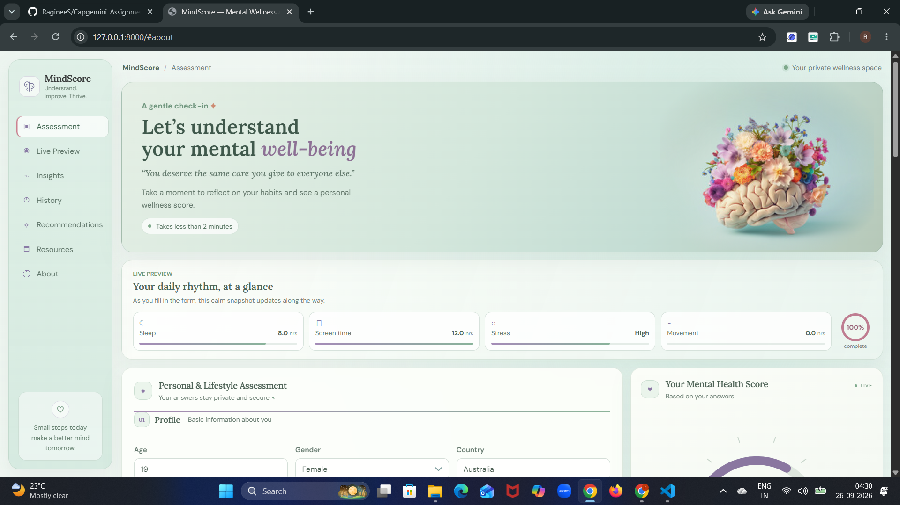
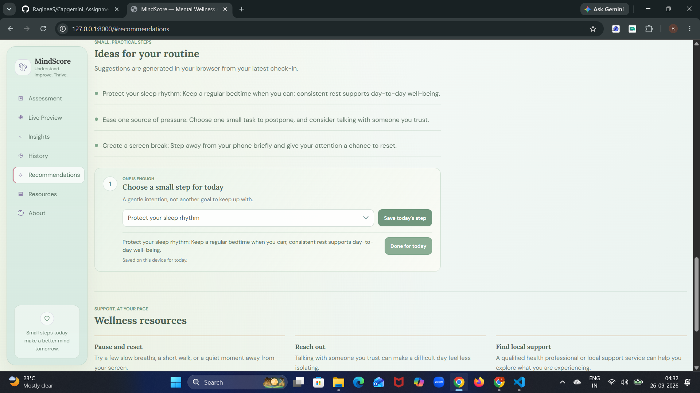

# 🧠 MindScore: Student Mental Wellness Check-In

MindScore is a web-based student wellness check-in application that uses **lifestyle, academic, social media, sleep, physical activity, and perceived-stress information** to estimate a mental health score using a machine-learning model.

The application combines an **ML-powered prediction system** with a responsive dashboard that provides personalized reflection insights, practical recommendations, and a simple daily small-step planner.

> ⚠️ **Important:** MindScore is designed for **self-reflection and educational purposes only**. It is not a medical or psychological assessment, diagnosis, or treatment recommendation.

---

## 🎥 App Demo

▶️ **[Watch the MindScore App Demo Video](https://drive.google.com/file/d/1F_vQdJXaZ_U0qcyXjWfkjckTVwes7Qm_/view?usp=sharing)**

The demo showcases the complete workflow:

**Assessment → ML Prediction → Score Visualization → Personalized Insights → Recommendations → Daily Planner → Score History**

> **Note:** Make sure the Google Drive video's sharing permission is set to **"Anyone with the link – Viewer"** so that others can access the demo.

---

## 📸 Screenshots

### Dashboard



### Assessment Results



---

## ✨ Features

### 📝 Lifestyle & Wellness Assessment

Users can provide information related to:

- Age and gender
- Country and academic level
- Most-used social media platform
- Purpose of social media usage
- Daily social media usage
- Daily device unlocks
- Study hours
- Physical activity
- Sleep duration
- Perceived stress level

---

### 🤖 ML-Based Mental Health Score Prediction

The assessment is submitted to the FastAPI backend, where the trained machine-learning model processes the input and generates a predicted mental health score.

The prediction pipeline uses:

- Python
- Pandas
- Scikit-learn
- Joblib
- FastAPI
- Pydantic

---

### 💡 Personalized Recommendations

Based on the assessment values and predicted score, MindScore provides practical suggestions designed to encourage healthier habits and self-reflection.

Examples include suggestions related to:

- Sleep
- Physical activity
- Study habits
- Screen time
- Stress management
- Daily routines

---

### 🌱 Daily Small-Step Planner

Users can select one recommended action and save it as their **daily small step**.

The planner allows users to:

- Select an action
- Save it for the current day
- Mark it as completed
- Automatically expire the saved step on the next local calendar day

The application intentionally does **not** track streaks.

---

### 📊 Score History

Users can review their recent prediction history.

The application:

- Stores up to **10 recent scores**
- Stores the associated dates
- Allows users to clear their history
- Keeps the history locally in the browser

---

### 📱 Responsive Dashboard

The interface is designed to work across:

- Desktop
- Laptop
- Tablet
- Mobile devices

The dashboard includes:

- Assessment form
- Live form preview
- Score visualization
- Insights
- Personalized recommendations
- Resources
- App information

---

### 🔐 Privacy-Conscious Local Storage

MindScore does not store assessment answers in browser storage.

Only the following are stored locally:

- Recent score history
- Selected daily planner step

This information is stored using the browser's `localStorage`.

> `localStorage` is browser- and device-specific. Clearing browser data can remove the saved history and planner state.

---

# 🏗️ System Workflow

```text
                ┌──────────────────────┐
                │      User Input      │
                │ Lifestyle Assessment │
                └──────────┬───────────┘
                           │
                           ▼
                ┌──────────────────────┐
                │    Frontend Layer    │
                │ HTML + CSS + JS       │
                └──────────┬───────────┘
                           │
                           │ JSON Request
                           ▼
                ┌──────────────────────┐
                │     FastAPI API      │
                │  Input Validation    │
                └──────────┬───────────┘
                           │
                           ▼
                ┌──────────────────────┐
                │   Data Preparation   │
                │       Pandas         │
                └──────────┬───────────┘
                           │
                           ▼
                ┌──────────────────────┐
                │   ML Prediction      │
                │ Scikit-learn Model   │
                │      + Joblib        │
                └──────────┬───────────┘
                           │
                           ▼
                ┌──────────────────────┐
                │ Predicted Wellness   │
                │        Score         │
                └──────────┬───────────┘
                           │
                           ▼
                ┌──────────────────────┐
                │ Dashboard Results    │
                │ Insights + Actions   │
                └──────────────────────┘
```

---

# 🛠️ Tech Stack

## Backend

- **Python**
- **FastAPI**
- **Uvicorn**
- **Pydantic**

## Machine Learning

- **Scikit-learn**
- **Pandas**
- **Joblib**
- Trained `.pkl` machine-learning model

## Frontend

- **HTML5**
- **CSS3**
- **Vanilla JavaScript**

## Browser Persistence

- **Browser localStorage**

## Development Tools

- Git
- GitHub
- VS Code
- Jupyter Notebook

---

# 📂 Project Structure

```text
MindScore/
│
├── main.py
├── index.html
├── style.css
├── script.js
│
├── Mental_Health_Model.pkl
├── Student Mental Health.csv
│
├── ML_Project.ipynb
├── ML Project.html
│
├── img.jpg
├── MH_dashboard.png
├── MH_assessment.png
│
├── requirements.txt
└── README.md
```

### File Description

| File | Purpose |
|---|---|
| `main.py` | FastAPI application, input validation, model prediction, and frontend asset routes |
| `index.html` | Main dashboard, assessment form, score view, and supporting sections |
| `style.css` | Theme, layout, responsive design, and component styling |
| `script.js` | Form validation, API calls, live preview, recommendations, history, and daily planner |
| `Mental_Health_Model.pkl` | Trained Scikit-learn model used by the `/predict` endpoint |
| `Student Mental Health.csv` | Dataset used for the machine-learning project |
| `ML_Project.ipynb` | Machine-learning development and experimentation notebook |
| `ML Project.html` | Exported ML project/reference page |
| `img.jpg` | Hero image used by the application |
| `MH_dashboard.png` | Application dashboard screenshot |
| `MH_assessment.png` | Assessment results screenshot |
| `requirements.txt` | Python dependencies required to run the application |
| `README.md` | Project documentation |

> **Note:** The virtual environment (`venv/`) should be created locally and should not be committed to GitHub.

---

# ⚙️ Installation & Setup

## 1. Clone the Repository

```bash
git clone <YOUR_GITHUB_REPOSITORY_URL>
cd MindScore
```

---

## 2. Create a Virtual Environment

### Windows

Open PowerShell inside the project directory:

```powershell
python -m venv venv
```

Activate the environment:

```powershell
.\venv\Scripts\Activate.ps1
```

If PowerShell blocks activation, you can use Command Prompt:

```cmd
venv\Scripts\activate.bat
```

You can also use the environment's Python directly without activating it.

---

## 3. Install Dependencies

Upgrade pip:

```powershell
python -m pip install --upgrade pip
```

Install project dependencies:

```powershell
python -m pip install -r requirements.txt
```

---

## 4. Start the FastAPI Server

Run:

```powershell
python -m uvicorn main:app --reload
```

The application will start locally.

Open:

```text
http://127.0.0.1:8000
```

in your browser.

Keep the terminal running while using the application.

To stop the server:

```text
Ctrl + C
```

---

# 🚀 Using the Application

### Step 1 — Open the Application

Navigate to:

```text
http://127.0.0.1:8000
```

---

### Step 2 — Complete the Assessment

Enter the requested information about:

- Lifestyle
- Academic routine
- Social media usage
- Sleep
- Physical activity
- Perceived stress

---

### Step 3 — Generate Your Score

Select your perceived stress level and click:

**Generate My Score**

The frontend sends the assessment data to the FastAPI backend.

---

### Step 4 — View Results

The application displays:

- Predicted wellness score
- Signal summary
- Personalized insights
- Recommended small steps

---

### Step 5 — Choose a Daily Small Step

Go to the **Recommendations** section and select one practical action.

The selected action can be:

- Saved for today
- Marked as completed

The saved action automatically expires on the next local calendar day.

---

### Step 6 — Review History

The **History** section displays the latest prediction results.

Users can:

- Review recent scores
- View associated dates
- Clear their local history

Only the latest **10 entries** are retained.

---

# 🔌 API Documentation

MindScore uses FastAPI for its backend API.

When the application is running, interactive API documentation is available at:

```text
http://127.0.0.1:8000/docs
```

---

## `POST /predict`

The `/predict` endpoint accepts the user's assessment information and returns a predicted mental health/wellness score.

### Request Fields

| Field | Description |
|---|---|
| `age` | User age |
| `gender` | Gender |
| `country` | Country |
| `academic_level` | Academic level |
| `most_used_platform` | Most-used social media platform |
| `purpose_of_use` | Main purpose of social media usage |
| `avg_daily_usage_hours` | Average daily usage |
| `daily_unlocks` | Number of daily device unlocks |
| `study_hours` | Daily study hours |
| `physical_activity_hours` | Daily physical activity |
| `sleep_hours_per_night` | Average sleep duration |
| `stress_level` | Perceived stress level |

---

## Example Request

```json
{
  "age": 21,
  "gender": "Female",
  "country": "India",
  "academic_level": "Undergraduate",
  "most_used_platform": "Instagram",
  "purpose_of_use": "Entertainment",
  "avg_daily_usage_hours": 4.0,
  "daily_unlocks": 60,
  "study_hours": 5.0,
  "physical_activity_hours": 1.0,
  "sleep_hours_per_night": 7.0,
  "stress_level": "Medium"
}
```

---

## Example Response

```json
{
  "predicted_mental_health_score": 6.31
}
```

> The predicted score depends on the input values and the trained machine-learning model.

---

# 🧠 Machine Learning Pipeline

The machine-learning component follows a basic prediction workflow:

```text
Dataset
   │
   ▼
Data Preprocessing
   │
   ▼
Feature Preparation
   │
   ▼
Model Training
   │
   ▼
Model Evaluation
   │
   ▼
Trained Model (.pkl)
   │
   ▼
FastAPI Backend
   │
   ▼
User Assessment
   │
   ▼
Prediction
   │
   ▼
MindScore Dashboard
```

The trained model is loaded by the FastAPI backend using **Joblib**.

---

# 🔒 Privacy & Data Handling

MindScore is designed with privacy-conscious behavior for this educational project.

### Assessment Data

Assessment answers are sent to the **local FastAPI API** for prediction and are not saved in browser `localStorage`.

### Browser Storage

The application stores only:

- Recent score history
- Selected daily planner action

### Important

Browser storage is:

- Local to the browser
- Specific to the device
- Removed when browser storage is cleared

MindScore does not claim to provide medical or clinical assessment.

---

# ⚠️ Limitations

This project is an educational machine-learning application and has several limitations:

- The predicted score is dependent on the training dataset and model quality.
- A machine-learning prediction cannot replace professional mental-health assessment.
- User-provided lifestyle information may not capture the full complexity of mental well-being.
- Browser-based history is not synchronized across devices.
- The application currently uses local browser storage rather than a dedicated user database.
- The model should not be interpreted as a clinical diagnostic system.

---

# 🔮 Future Improvements

Potential future improvements include:

- User authentication and secure profiles
- Secure cloud-based storage
- Long-term wellness trend visualization
- More comprehensive ML models
- Model explainability using SHAP or similar techniques
- Personalized recommendation ranking
- Improved model validation on larger and more diverse datasets
- Multilingual support
- Accessibility improvements
- Mobile application
- Secure deployment with HTTPS
- Real-time wellness dashboards
- Professional-resource integration
- Better uncertainty/confidence reporting for predictions

---

# 📌 Project Highlights

MindScore demonstrates the integration of:

- Machine Learning
- Data preprocessing
- REST APIs
- FastAPI
- Frontend development
- Browser-side persistence
- Responsive UI design
- Personalized recommendation logic
- ML model deployment

The project combines an end-to-end **machine-learning prediction pipeline** with an interactive web application.

---

# 📜 Disclaimer

MindScore's predictions and recommendations are intended **only for personal reflection and educational demonstration**.

They are **not medical advice, a diagnosis, or a substitute for professional mental-health care**.

If you are concerned about your mental health or well-being, consider speaking with a qualified healthcare or mental-health professional or contacting an appropriate local support service.

---

# 👩‍💻 Author

**Raginee**

B.Tech — Information Technology

Indira Gandhi Delhi Technical University for Women (IGDTUW)

---

⭐ If you find this project useful, consider giving the repository a star
